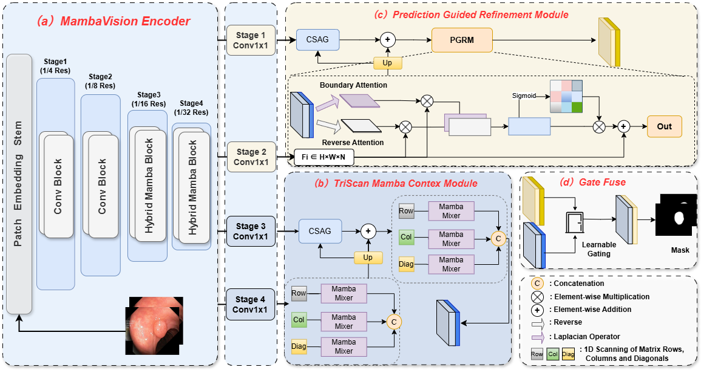
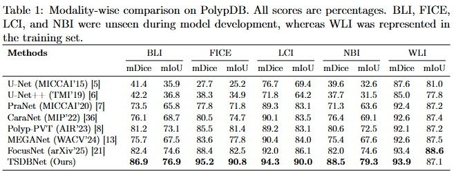
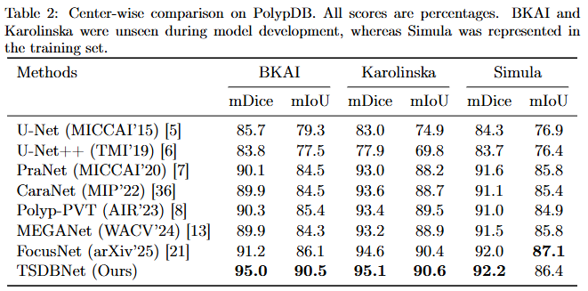
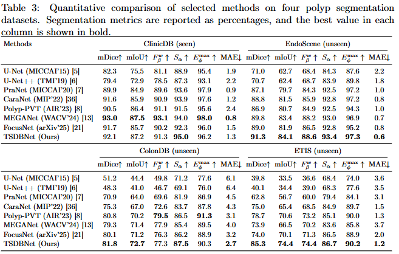
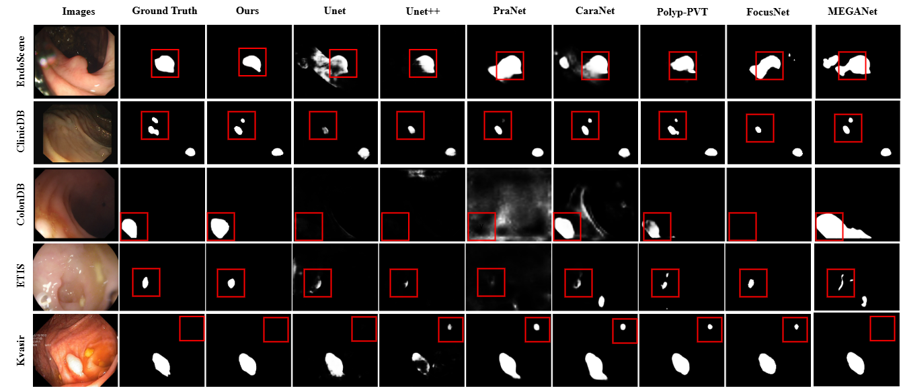
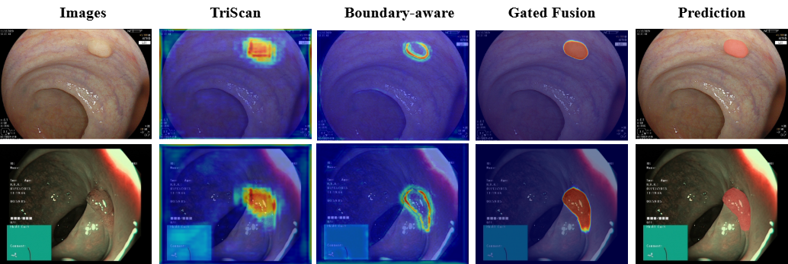

# TSDBNet

**TSDBNet: A Dual-Branch Decoder with TriScan Mamba-Based Context Modeling for Polyp Segmentation**

Official PyTorch implementation of TSDBNet, a polyp segmentation network built on [MambaVision](https://github.com/NVlabs/MambaVision) and [MMSegmentation](https://github.com/open-mmlab/mmsegmentation).

<p align="center">
  
</p>

## Results

The following results are reported in our manuscript. All values are percentages. BLI, FICE, LCI, and NBI are unseen modalities; BKAI and Karolinska are unseen centers.

<p align="center">
  
</p>

<p align="center">
  
</p>

<p align="center">
  
</p>

<p align="center">
  
</p>

<p align="center">
  
</p>

## Installation

The reference environment uses Python 3.10, PyTorch 2.4.1 with CUDA 12.4, MMCV 2.1.0, MMEngine 0.10.1, and MMSegmentation 1.2.2.

```bash
git clone https://github.com/YGJing7/TSDBNet.git
cd TSDBNet

conda create -n tsdbnet python=3.10 -y
conda activate tsdbnet

pip install torch==2.4.1 torchvision==0.19.1 --index-url https://download.pytorch.org/whl/cu124
pip install -U openmim
mim install "mmengine==0.10.1"
mim install "mmcv==2.1.0"
pip install mamba-ssm==2.2.4 timm==1.0.15 einops==0.8.1
pip install opencv-python-headless pillow scipy tabulate tqdm
pip install -v -e ./mmsegmentation
```

If your CUDA version differs, install the matching PyTorch and MMCV builds by following the official [PyTorch](https://pytorch.org/get-started/locally/) and [MMSegmentation](https://mmsegmentation.readthedocs.io/en/latest/get_started.html) installation guides.

## Pretrained Backbone

Download the ImageNet-1K pretrained [MambaVision-B checkpoint](https://huggingface.co/nvidia/MambaVision-B-1K/resolve/main/mambavision_base_1k.pth.tar) and place it at:

```text
ckpts/mambavision_base_1k.pth.tar
```

Before training, set the `pretrained` field in the selected config to this checkpoint path. For example:

```python
pretrained="ckpts/mambavision_base_1k.pth.tar"
```

## Data Preparation

- Polyp:  [training](https://drive.google.com/file/d/1YiGHLw4iTvKdvbT6MgwO9zcCv8zJ_Bnb/view) and [testing](https://drive.google.com/file/d/1Y2z7FD5p5y31vkZwQQomXFRB0HutHyao/view) datasets are the same as [PraNet](https://github.com/DengPingFan/PraNet).
- PolypDB: datasets [PolypDB](https://osf.io/pr7ms/files/osfstorage) are the same as [FocusNet](https://github.com/JunZengz/FocusNet).

Update `data_root` in the corresponding dataset config before running an experiment:

| Experiment | Dataset config |
| --- | --- |
| Multi-dataset | `semantic_segmentation/configs/_base_/datasets/polypseg.py` |
| PolypDB cross-modality | `semantic_segmentation/configs/_base_/datasets/polypdb_modality.py` |
| PolypDB cross-center | `semantic_segmentation/configs/_base_/datasets/polypdb_center.py` |

### Multi-dataset protocol

Arrange the training and test data as follows:

```text
data/polyp
├── TrainDataset/
│   ├── images/
│   └── masks_binary/
└── TestDataset/
    ├── CVC-300/
    │   ├── images/
    │   └── masks_binary/
    ├── CVC-ClinicDB/
    │   ├── images/
    │   └── masks_binary/
    ├── CVC-ColonDB/
    │   ├── images/
    │   └── masks_binary/
    ├── ETIS-LaribPolypDB/
    │   ├── images/
    │   └── masks_binary/
    └── Kvasir/
        ├── images/
        └── masks_binary/
```

### PolypDB protocols

```text
data/polypdb
├── train/
│   ├── images/
│   └── masks/
├── val/
│   ├── images/
│   └── masks/
└── test/
    │   ├── images/
    │   └── masks/
    └── ...
```

The modality-wise test folders are `BLI`, `FICE`, `LCI`, `NBI`, and `WLI`. The center-wise test folders are `BKAI`, `Karolinska`, and `Simula`; the current test scripts expect a `WLI` subfolder inside each center folder.

## Training

Run all commands from the repository root. The scripts in `semantic_segmentation/tools` can be executed directly.

```bash
python semantic_segmentation/tools/train_polyp.py
```

```bash
python semantic_segmentation/tools/train_polypdb_modality.py
```

```bash
python semantic_segmentation/tools/train_polypdb_center.py 
```

## Testing

Pass the trained checkpoint with `--checkpoint`. Each test script automatically evaluates all datasets in its protocol.

```bash
python semantic_segmentation/tools/test_polyp.py 
```

```bash
python semantic_segmentation/tools/test_polypdb_modality.py 
```

```bash
python semantic_segmentation/tools/test_polypdb_center.py
```

###  Evaluation

After generating multi-dataset predictions, compute the full set of polyp segmentation metrics with:

```bash
python evaluate_polyp.py 
```

The evaluator reports mDice, mIoU, weighted F-measure, structure measure, enhanced-alignment measure, MAE, sensitivity, and specificity, and saves a CSV summary under the prediction directory.

## Acknowledgements and Licenses

This project is built on [MMSegmentation](https://github.com/open-mmlab/mmsegmentation) and [MambaVision](https://github.com/NVlabs/MambaVision). We thank their authors for releasing their code and pretrained models.

The incorporated upstream code and pretrained weights remain subject to their respective licenses. In particular, MambaVision source code is released under the NVIDIA Source Code License-NC, and its pretrained weights are released under CC BY-NC-SA 4.0. Please review the upstream license terms before use or redistribution.
